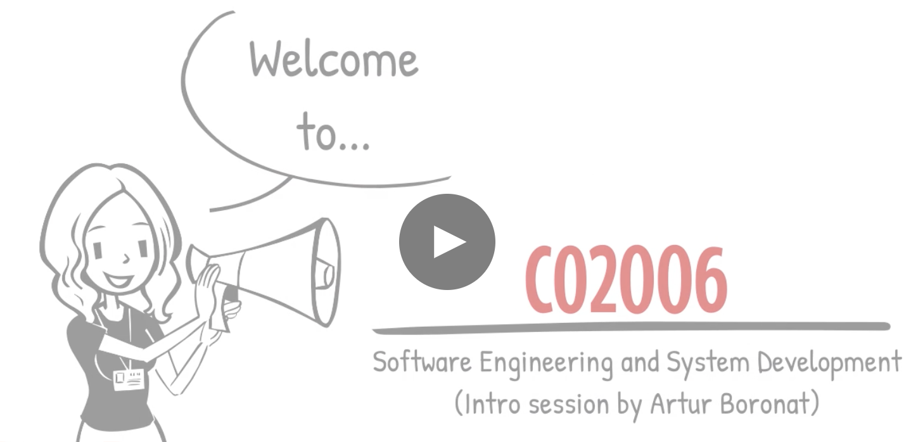
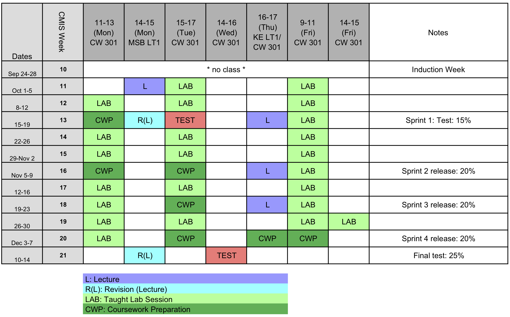
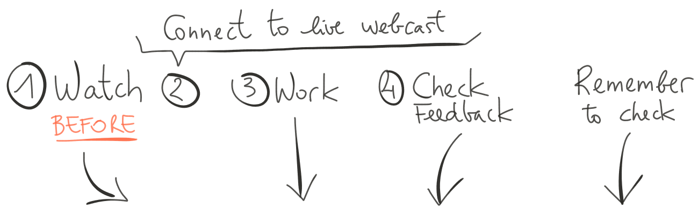

<link rel='stylesheet' href='./web/swiss.css'/>

Study Guide

## Study Guide

The **study guide** is available :notebook_with_decorative_cover: [here](./CO2006-studyguide-18-19.pdf).

## Module Structure and Timetable 

The module is split in four main parts, called [sprints](https://en.wikipedia.org/wiki/Scrum_(software_development)#Sprint), and each sprint has a goal, that is an assessed component:

| Sprint | Assignment | Weight | Deadline |
|--|--|--|--|
| [Sprint 1. Agile practices and build automation](#sprint-1-agile-practices-and-build-automation) | Test | 15% | Tue 16 Oct, 15:00 (CWB 301) |
| [Sprint 2. Spring MVC (business logic and validation)](#sprint-2-spring-mvc-business-logic-and-validation) | Homework | 20% | Tue 6 Nov, 23:59 |
| [Sprint 3. Quality Assurance (Behaviour-Driven Development)](#sprint-3-quality-assurance-behaviour-driven-development) | Homework | 20% | Tue 20 Nov, 23:59 |
| [Sprint 4. Spring Data (JPA) and Spring Security](#sprint-4-spring-data-jpa-and-spring-security) | Homework | 20% | Fri 7 Dec, 23:59 |
|  | Final test | 25% | Wed 12 Dec, 14:00 (CWB 301) |

See below the timetable for the term:

 
 
 

### Lectures/Lab sessions

#### Sprint 1. Agile practices and build automation

The goal for this sprint is a test on agile practices in software development, Groovy and Gradle:
* :dart: **TEST: Tuesday 16th October, CW3 Lab (out of 100, weight: 15%): 15:00-15:50**
* :nerd_face: Contents to be assessed in the test summarised [here](./sprint1.test.md#contents-for-test-sprint-1)
  * The **revision session** will be on **Monday 15 October, 14:00, in Brookfield Lecture Theatre**
* :computer: A sample test is available [here](https://bit.ly/2DE8j1I) (this is a link to Blackboard and you need to be signed in for it to work)

&nbsp;&nbsp;&nbsp;&nbsp;&nbsp;&nbsp;&nbsp;&nbsp;&nbsp;&nbsp;&nbsp;&nbsp;&nbsp;&nbsp;&nbsp;&nbsp;&nbsp;&nbsp;&nbsp;&nbsp;&nbsp;&nbsp;&nbsp;&nbsp;&nbsp;&nbsp;&nbsp;&nbsp;&nbsp;&nbsp;&nbsp;&nbsp;&nbsp;&nbsp;&nbsp;&nbsp;&nbsp;&nbsp;&nbsp;&nbsp;&nbsp;&nbsp;&nbsp;&nbsp;&nbsp;&nbsp;&nbsp;&nbsp;&nbsp;&nbsp;&nbsp;&nbsp;&nbsp;&nbsp;&nbsp;&nbsp;&nbsp;&nbsp;&nbsp;&nbsp;&nbsp;&nbsp;&nbsp;&nbsp;&nbsp;&nbsp;&nbsp;&nbsp;&nbsp;&nbsp;&nbsp;

| Topic | Lecture  (:warning: watch before the session) | Worksheet | Solution | Additional resources | 
|--|--|--|--|--|
| Introduction to Build Automation | - | - | - | :movie_camera: [lecture](https://leicester.cloud.panopto.eu/Panopto/Pages/Viewer.aspx?id=a4e9fc02-2df3-4a00-b55b-a96d00c81305),   :notebook_with_decorative_cover: [slides](./lectureNotes/sprint1.lecture.pdf),  :movie_camera: [Waterfall Fundamentals and Its Problems (21:14)](https://app.pluralsight.com/player?course=agile-fundamentals&author=stephen-haunts&name=agile-fundamentals-m2&clip=0&mode=live),   :movie_camera: [What is agile all about? (28:41)](https://app.pluralsight.com/player?course=agile-fundamentals&author=stephen-haunts&name=agile-fundamentals-m3&clip=0&mode=live),   :movie_camera: [Common agile misconceptions (20:12)](https://app.pluralsight.com/player?course=agile-fundamentals&author=stephen-haunts&name=agile-fundamentals-m4&clip=0&mode=live),  :movie_camera: [Advantages and disadvantages (18:48)](https://app.pluralsight.com/player?course=agile-fundamentals&author=stephen-haunts&name=agile-fundamentals-m5&clip=0&mode=live) |  
| Integrated Development Environments (IDEs)	 | :movie_camera: [Intro to IDEs (19:33)](https://leicester.cloud.panopto.eu/Panopto/Pages/Viewer.aspx?id=9624f170-8536-4ad6-9655-a96500e049e9),   :movie_camera: [Pair programming (16:05)](https://leicester.cloud.panopto.eu/Panopto/Pages/Viewer.aspx?id=a21e8ac3-d6ee-4ccc-bf7b-a96c00a0af9c) | :computer: [worksheet](./sprint1/IDE_exercises/) |  | :notebook_with_decorative_cover: lecture notes ([PDF](./lectureNotes/sprint1.lab1.IDE.pdf), [HTML](./lectureNotes/sprint1.lab1.IDE.md)) |
| Groovy (basic syntax and collections) | :movie_camera: [Intro to Groovy (26:35)](https://app.pluralsight.com/player?course=groovy-fundamentals&author=jeremy-jarrell&name=groovy-fundamentals-m1&clip=0&mode=live) | :computer: [worksheet](./sprint1/Groovy_exercises/) | | :notebook_with_decorative_cover: lecture notes ([PDF](./lectureNotes/sprint1.lab2.Groovy.pdf), [HTML](./lectureNotes/sprint1.lab2.Groovy.md))   :movie_camera: [Groovy's basic syntax (31:13)](https://app.pluralsight.com/player?course=groovy-fundamentals&author=jeremy-jarrell&name=groovy-fundamentals-m2&clip=0&mode=live) |  
|  Gradle (tasks and dependencies)  		| :movie_camera: [Intro to Gradle (18:59)](https://app.pluralsight.com/player?course=gradle-fundamentals&author=kevin-jones&name=gradle-fundamentals-m1&clip=0&mode=live),    :movie_camera: [Tasks (20:50)](https://app.pluralsight.com/player?course=gradle-fundamentals&author=kevin-jones&name=gradle-fundamentals-m2&clip=0&mode=live) |  | | :movie_camera: [Task dependencies (17:18)](https://app.pluralsight.com/player?course=gradle-fundamentals&author=kevin-jones&name=gradle-fundamentals-m3&clip=0&mode=live) |
| Gradle (Plugins - Java, Groovy) 		| :movie_camera: [Java projects (24:15)](https://app.pluralsight.com/player?course=gradle-fundamentals&author=kevin-jones&name=gradle-fundamentals-m5&clip=0&mode=live) |  | |  :movie_camera: [Typed tasks (11:36)](https://app.pluralsight.com/player?course=gradle-fundamentals&author=kevin-jones&name=gradle-fundamentals-m4&clip=0&mode=live) | 
| Gradle (external dependencies, testing, wrapper) 		| :movie_camera: [External dependencies (24:15)](https://app.pluralsight.com/player?course=gradle-fundamentals&author=kevin-jones&name=gradle-fundamentals-m5&clip=0&mode=live) |  | | :movie_camera: [Testing (16:13)](https://app.pluralsight.com/player?course=gradle-fundamentals&author=kevin-jones&name=gradle-fundamentals-m7&clip=0&mode=live) | 

 
 
 

<b>Sprint 2</b> (click me to expand)

#### Sprint 2. Spring MVC (business logic and validation)

:warning: The links under this section will be enabled once sprint 2 starts. 

The goal of this Sprint is to develop a web application. 

* :dart: [mini project worksheet](./miniproject.md) (the link will not work until the worksheet is released):
  * **marks: 100, weight: 20%** of overall mark
  * [checkpoint](): **Tue 23 Oct, 23:59, weight 10% of sprint 2**
  * [release](): **Tue 6 Nov, 23:59, weight 90% of sprint 2**
* :loudspeaker: [solution miniproject (source code)]() (TBA)
  * [feedback form]()

| Topic | Lecture  (:warning: watch before the session) | Worksheet | Solution | Additional resources | 
|--|--|--|--|--|
| Introduction to Spring MVC				|  |  | | :movie_camera: [lecture](),    :notebook_with_decorative_cover: [slides]() | 
| Spring MVC (basics)					| :movie_camera: [lecture]() | :computer: [worksheet]() |  | | 
| Spring MVC (model)						| :movie_camera: [lecture]() | :computer: [worksheet]() |  | |
| Controllers (request mappings) 		| :movie_camera: [lecture]() | :computer: [worksheet]() |  | |
| Views (JSP, JSTL)						| :movie_camera: [lecture]() | :computer: [worksheet]() |  | |
| Controllers (forms)			 		| :movie_camera: [lecture]() | :computer: [worksheet]() |  | |
| Spring Validation						| :movie_camera: [lecture]() | :computer: [worksheet]() |  | |

 
 
 

<b>Sprint 3</b> (click me to expand)

#### Sprint 3. Quality Assurance (Behaviour-Driven Development)

:warning: The links under this section will be enabled once sprint 3 starts.

The goal of this Sprint is to develop a web application:
* :dart: [mini project worksheet](./miniproject.md) (the link will not work until the worksheet is released):
  * **marks: 100, weight: 20%** of overall mark
  * [checkpoint](): **Tue 13 Nov, 23:59, weight 10% of sprint 3**
  * [release](): **Tue 20 Nov, 23:59, weight 90% of sprint 3**
* :loudspeaker: [solution miniproject (source code)]() (TBA)
  * [feedback form]()
  
| Topic | Lecture  (:warning: watch before the session) | Worksheet | Solution | Additional resources | 
|--|--|--|--|--|
| Introduction to Quality Assurance			|  |  | | :movie_camera: [lecture](),    :notebook_with_decorative_cover: [slides]() | 
| TDD with JUnit/Hamcrest			|  :movie_camera: [lecture]() | :computer: [worksheet]() |  | |
| Triangulation 						|  :movie_camera: [lecture]() | :computer: [worksheet]() |  | |
| Spock 								| :movie_camera: [lecture]() | :computer: [worksheet]() |  | |
| Spring Test Framework				|  :movie_camera: [lecture]() | :computer: [worksheet]() |  | |
| Testing criteria			 		|  :movie_camera: [lecture]() | :computer: [worksheet]() |  | |

 
 
 

<b>Sprint 4</b> (click me to expand)

#### Sprint 4. Spring Data (JPA) and Spring Security

:warning: The links under this section will be enabled once sprint 4 starts.

The goal of this Sprint is to develop a web application:
* :dart: [mini project worksheet](./miniproject.md) (the link will not work until the worksheet is released):
  * **marks: 100, weight: 20%** of overall mark
  * [checkpoint](): **Thu 29 Nov, 23:59, weight 10% of sprint 4**
  * [release](): **Fri 7 Dec, 23:59, weight 90% of sprint 4**
* :loudspeaker: [solution miniproject (source code)]() (TBA)
  * [feedback form]()

| Topic | Lecture  (:warning: watch before the session) | Worksheet | Solution | Additional resources | 
|--|--|--|--|--|
| Intro to Spring Data/Security			|  |  | | :movie_camera: [lecture](),    :notebook_with_decorative_cover: [slides]() | 
| Revision SQL |  |  :computer:[exercise 01](./ex01.md)    :movie_camera: [explanation]() |  | |
| ORM problem | :movie_camera: [ORM1 (16:53)]() | :computer: [exercise 02](./sprint4.ex02/)    :movie_camera:[explanation]() |  |  |
| ORM solution (JPA) | :movie_camera: [ORM2 (15:11)]() |  :computer:[exercise 03](./sprint4.ex03/)   :movie_camera:[explanation]() |  |  |
| Spring Data | :movie_camera: [ORM3 (25:04)]() |  :computer: [exercise 04](./sprint4.ex04/)   :movie_camera: [explanation]() |  |   |   |
| Spring Data |  | :computer: [exercise 05](./sprint4.ex05/)   :movie_camera:  [explanation]() | |  |  |
| Spring Security  | :movie_camera: [Spring Security (54:14)]() |  :computer: [exercise 06](./sprint4.ex06/)   :movie_camera: [explanation]() |  |  | Watch the lecture, fetch ex06 and watch its explanation. |  

 
 
 

<b>Final Test</b> (click me to expand)

#### Final test (assessed coursework)

* :dart: **Final Test (covering sprints 2, 3 and 4): Wednesday 12th December, 14:00-15:00**
* :nerd_face: Contents to be assessed in the test summarised here
  * The **revision session** will be on **Monday 10th December, 14:00, in KE LT2**
* :computer: A sample test can be found [here]()

 
 
 

## Other resources

### IDE and Tooling

The tools that we are going to use in this module are reported [here](./tooling.md)   

