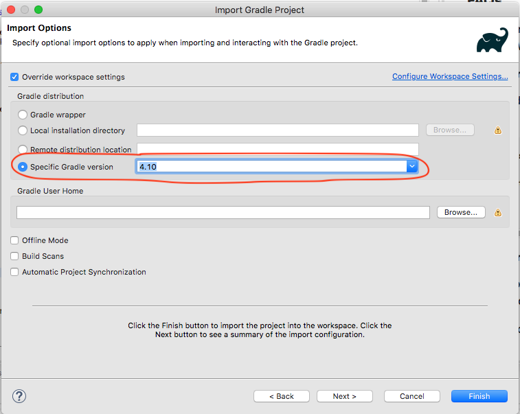

<link rel='stylesheet' href='./web/swiss.css'/>

# Frequently Asked Questions - CO2006

Table of contents:
* [Gradle version](#gradle-version)
* [Working from home](#working-from-home)

If you are aware of a topic that is not listed above and that may be of interest for everyone, please let us know. Thanks!


## Gradle version 

Whenever you find a machine with an old version of Gradle (< 4.9) installed, please email `sysadmin@mcs.le.ac.uk` with the following text:

```
Dear sysadmin,

I'm a student of CO2006 and I've been advised to report that the machine ${MACHINE_NUMBER} does not have the latest version (4.10) of Gradle installed.

Thanks.
```

Please replace `${MACHINE_NUMBER}` with the corresponding PC number.

A temporary workaround to that problem is as follows:
* Import a Gradle project as usual.
* As shown in the picture, instead of selecting Gradle wrapper, select a specific Gradle version.



## Working from home

It is possible to use a remote desktop client (X2Go) to work in a lab machine from home (or from a different machine). Please read [these instructions](https://campus.cs.le.ac.uk/labsupport/usinglinux/remotelinux).
