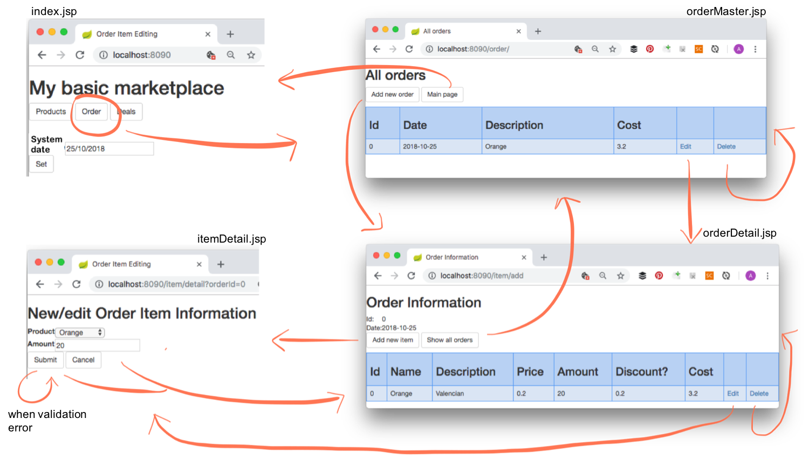

<link rel='stylesheet' href='web/swiss.css'/>

# CO2006 18-19 - SPRINT 2 - MINIPROJECT

This assignment is worth **20%** of the overall module mark and the mark is provided out of **100**:
* 5% for doing exercises in the lab sessions
* 5% for the checkpoint submission
* 90% for the release submission

Table of contents:
* [Plagiarism and Collusion](#disclaimer-on-plagiarism-and-collusion)
* [Exercise](#exercise)
* [Submission procedure](#submission-procedure-and-marking-guidelines)

## Disclaimer on Plagiarism and Collusion

This is an **individual piece of coursework** that is assessed. Plagiarism, including collusion, is penalized. For further information check the [section Referencing and Academic Integrity in the BSc handbook](https://campus.cs.le.ac.uk/ForStudents/).

By submitting your solution, you are stating that you are aware of the consequences, as summarized in the [Declaration of Academic Honesty](https://campus.cs.le.ac.uk/ForStudents/plagiarism/DoAIF.pdf) that you signed already, and that the solution provided for the worksheet is the result of your **sole individual work**, when working alone, or your **work as a team**, when working in pairs.

Note that the fact that you are working with someone else in the lab sessions does not justify the co-submission of highly similar code, unless you state that you are working in pairs.

## Exercise

The goal of this worksheet is to develop a functional feature for an online shop web application developed in Spring MVC and Java. The [project containing the code base](./sprint2.miniproject/	) only implements a catalogue of products using the typical [CRUD operations](https://en.wikipedia.org/wiki/Create,_read,_update_and_delete). **Please do not modify the name of the project.**

In this sprint, you are asked to implement an order mechanism in the system so as to meet the requirements stated below. 

The prototype must be deployed at server port `8090`.

### Codebase and location of classes to be implemented

The **JSP views MUST NOT be modified** and they should be used to guide the development of the code (e.g. by using the values stated in form attributes - `path` attributes in form fields, `modelAttribute`, action request - and in EL expressions). The main (JSP) views are the following:
* `My basic marketplace` ([JSP code](./sprint2.miniproject/src/main/webapp/WEB-INF/views/index.jsp)) 
* `Product Creation (detail)` ([JSP code](./sprint2.miniproject/src/main/webapp/WEB-INF/views/form/productDetail.jsp)) 
* `Product Listing (master)` ([JSP code](./sprint2.miniproject/src/main/webapp/WEB-INF/views/form/productMaster.jsp)) 
* `Product Deal Management` ([JSP code](./sprint2.miniproject/src/main/webapp/WEB-INF/views/form/productDeal.jsp)) 
* `Order Creation (master for order items, detail for order)` ([JSP code](./sprint2.miniproject/src/main/webapp/WEB-INF/views/form/orderDetail.jsp)) 
* `Order Listing (master for orders)` ([JSP code](./sprint2.miniproject/src/main/webapp/WEB-INF/views/form/orderMaster.jsp)) 
* `Order Item Creation (detail)` ([JSP code](./sprint2.miniproject/src/main/webapp/WEB-INF/views/form/itemDetail.jsp)) 

The system has to be completed by developing code for the business logic/validation requirements stated below in the following classes - **ONLY these classes can be modified**:
* Controller class [eMarket.controller.OrderController](./sprint2.miniproject/src/main/java/eMarket/controller/OrderController.java)
* Controller class [eMarket.controller.ItemController](./sprint2.miniproject/src/main/java/eMarket/controller/ItemController.java)
* Validator class [eMarket.controller.ItemValidator](./sprint2.miniproject/src/main/java/eMarket/controller/ItemValidator.java)

This **navigation model** (mockup interfaces for each view and transitions between views, normally due to the action of a button) provides the big picture of the system:

The :movie_camera: [demo of the system](https://leicester.cloud.panopto.eu/Panopto/Pages/Viewer.aspx?id=782c2163-8da7-4ac6-ac1e-a98600b626f8) illustrates a prototype of the system completing the information given in the navigation model. 

### Part 1: Order creation

#### Navigation [10 marks] :star:

For each of the requirements below you will have to: 

* Write a method in the corresponding controller with the appropriate signature.
* Write a request mapping the urls that you get when clicking on a button to your method.
* Add the corresponding return statement to select the target view.
  
Apply the steps above to implement the following requirements:

1. When clicking on `Order` in the view `index`, the user must be redirected to the view `orderMaster`. 
2. When clicking on `Main Page` in the view `orderMaster`, the user must be redirected to the view `index`. 
3. When clicking on `Add new order` in the view `orderMaster`, the user must be redirected to the view `orderDetail`. 
4. When clicking on `Edit` for a specific order in the view `orderMaster`, the user must be redirected to the view `orderDetail`. 
5. When clicking on `Delete` for a specific order in the view `orderMaster`, the user must be redirected to the view `orderMaster`. 

#### Business logic requirements [20 marks] :star::star:

These steps involve adding Java code in a method of a controller, implementing the functional requirements described below:

6. When clicking on `Add new order` in the view `orderMaster`, a new order must be created and added in the store `EMarketApp.store.orderList`. We are using `EMarketApp.store` as an abstraction of a data store that we will replace with a real database in sprint 4. The date of the new order must be the system date, the one that appears in the view `index`.  
7. When the list of orders is displayed in the view `orderMaster`, the following information must be displayed for each order in `EMarketApp.store.orderList`:
    * `id`: identifier
    * `date`: date of creation
    * `description`: description
    * `cost`: sum of the cost for each item in the order (`item.product.price * item.amount`)
8. When clicking on `Edit` for a specific order in the view `orderMaster`, the view `orderDetail` must display the details of the chosen order.
9. When clicking on `Delete` for a specific order in the view `orderMaster`, the selected order must be deleted from `EMarketApp.store.orderList`.

### Part 2: Order Item Creation

#### Navigation [10 marks] :star:

10. When clicking on `Show all orders` in the view `orderDetail`, the user must be redirected to the view `orderMaster`. 
11. When clicking on `Add new item` in the view `orderDetail`, the user must be redirected to the view `itemDetail`. 
12. When clicking on `Submit` in the view `itemDetail`, and there are no validation errors, the user must be redirected to the view `orderDetail`. 
13. When clicking on `Submit` in the view `itemDetail`, and there are validation errors, the user must be redirected to the view `itemDetail`. 
14. When clicking on `Cancel` in the view `itemDetail`, the user must be redirected to the view `orderDetail`. 

#### Business logic requirements [20 marks] :star::star:

15. When adding a new item by clicking on `Add new item` in view `orderDetail`, a new object `OrderItem` must be created and linked to the form in the view `itemDetail`. 
16. When editing an existing item by clicking on `Edit` in view `orderDetail`, the corresponding `OrderItem` must be fetched from its corresponding order, which is stored in `EMarketApp.store.orderList`.
17. When deleting an existing item by clicking on `Delete` in view `orderDetail`, the corresponding `OrderItem` must be deleted from its corresponding order, which is stored in `EMarketApp.store.orderList`.
18. When adding a new item by clicking on `Submit` in view `itemDetail`, a new `OrderItem` will be created and appended to the `itemList` of the selected order (its identifier needs to be remembered when going from `orderDetail` to `itemDetail`):
    * the `product` must reference the corresponding product in `EMarketApp.store.productList`;
    * the `amount` must be set with the amount in the form in view `itemDetail`;
    * the `cost` must correspond to `amount * product.price`.

#### Form validation requirements [10 marks] :star::star:

19. In view `itemDetail`, when submitting a new item, if the field `amount` is empty an error must be displayed next to the field `amount`.
20. In view `itemDetail`, when submitting a new item, if the `amount` provided is negative an error must be displayed next to the field `amount`.

#### Business logic requirements: apply discounts from active deals [20 marks] :star::star::star:

21. When adding a new item by clicking on `Submit` in view `itemDetail`, the system should check if there is an active deal for the selected product in `EMarketApp.store.dealList`. In that case the discounted cost should be computed by applying the discount with the formula `(product.price - deal.discount * product.price) * amount`. Feel free to refactor the formula using your algebra skills. A deal is active for an order when:
    * the start date of the deal is before or equal to the order creation date, and there is no end date for the deal;
    * the start date of the deal is before or equal to the order date, and the end date of the deal is after or equal to the order creation date.
22. In the view `orderDetail`, display the cost of each item after applying discounts if there are active deals for the product of the order item.
23. In the view `orderMaster`, display the cost of the deal after applying discounts to each line item.

## Submission procedure and marking guidelines

If you are working alone jump to the description of the checkpoint directly.

**If you are working in pairs**, please enter the following details, for each student, using [this form](https://goo.gl/forms/M9Su9bQymIF9ymEB3):
* University username, e.g. `ab123`
* % Contribution towards the worksheet, e.g. `50` for indicating 50% if both student contributed equally. Otherwise adjust the contributions so that their sum is 100. 

As an example to show how these contributions are used to compute the final individual mark, if the final mark (checkpoint+release) is 78 out of 95, when a student `ab123` implemented part 1 and a student `xy123` implemented part 2, their contributions and corresponding marks would look as follows:

| username | contribution | pair mark (checkpoint+release) | individual mark (checkpoint+release) | effort | final individual mark |
|--|--|--|--|--|--|
| ab123 | 33.3% (30 out of 90) | 78 | 54.68 | 5 | 60 |
| xy123 | 66.6% (60 out of 90) | 78 | 95 | 5 | 100 |

That is, it is assumed that the target share is 50% of the worksheet (47.5 out of 95 marks) and the individual mark is computed with respect to it. That is, the individual mark for the worksheet for student `ab123` is computed using `33.3 * 78 / 47.5 = 54.68` out of `95`, and then we have to add the effort mark. For student `xy123`, the mark is `66.6 * 78 / 47.5 = 109.3`, which is capped at `95` (the maximum value), and then we have to add the corresponding effort mark. 

Note that we are not going to resolve conflicts in pairs. Once a pair is formed and has worked together in the solution, they cannot split as this would lead to **collusion** (plagiarism) when we check your solutions. You may choose to work with someone else for the next sprint, or simply work alone.

### Checkpoint

The deadline is **Tue 30 Oct, 23:59**.

During the lab session we will show how to implement the first part (order creation), by applying what is used in exercises in the lab. 

For submitting your solution, do as follows:
* Open a terminal, change directory to the directory of your project and run `./gradlew clean`.
* From a file manager, select the folder representing the directory of your project and zip it.
* Submit it via Blackboard using the assignment `Sprint 2 Checkpoint`, under `Assessment and Feedback`.

The project must contain **NO compilation errors** and it must be executable with the command `./gradlew clean bootRun` (or `gradlew clean bootRun` for `MS Windows`). **NO MARKS will be awarded if this does not execute.**

You will receive feedback on your submission but we are going to focus on checking that your web app is configured and that you are working on it. Full marks on the first part of the miniproject will be given at the end of the sprint, after the final submission. That is, feel free to submit a partial implementation of the first part at the checkpoint but make sure there are **no compilation errors**. If there is code that does not compile, comment it.

#### Marking guidelines

We are going to consider that the software infrastructure for the assignment is set up:
1. When unzipping the file, a folder `sprint2.miniproject` is obtained and this folder contains the file `build.gradle` for your project: 2.5 marks
2. The `./gradlew clean bootRun` command can be executed without problems (there are no compilation errors): 2.5 marks

### Release 

The deadline is **Tue 6 Nov, 23:59**

Follow the steps described above but submit a full implementation of all of the requirements explained above (Part 1 and Part 2).

Submit it via Blackboard using the assignment `Sprint 2 Release`, under `Assessment and Feedback`.

The project must contain **NO compilation errors** and it must be executable with the command `./gradlew clean bootRun` (or `gradlew clean bootRun` for `MS Windows`). **NO MARKS will be awarded if this does not execute.**

#### Marking guidelines

The submitted project must compile and it must be executable as explained in the worksheet (e.g. there are compilation errors) with the command `./gradlew clean bootRun`. Otherwise, the submission will receive a mark of `0` (`zero`).

Whenever a section contains several requirements, the implementation of each requirement carries equal marks. For example, when a section on navigation requirements is worth 10 marks and contains 5 requirements, the implementation of each requirement is worth 2 marks.

The following aspects are going to be considered when marking your release submission:
* The mockup interfaces described must be integrated within the code developed for the system to be marked, that is, no compilation errors are allowed.
* Each of the navigation routes described will be marked as either correct or incorrect. 
* Each of the functional requirements described above will be marked as either correct or incorrect. 
* Each of the validation scenarios will be marked as either correct or incorrect. Errors should be reported by using messages next to the field containing the cause of the error in the view.

***
&copy; Artur Boronat, 2018-19